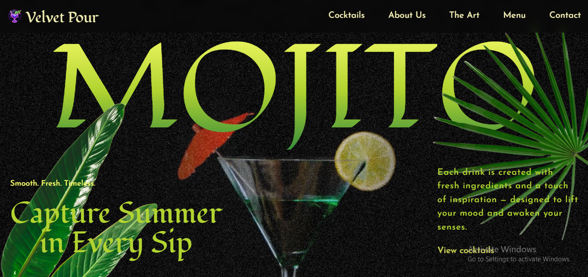
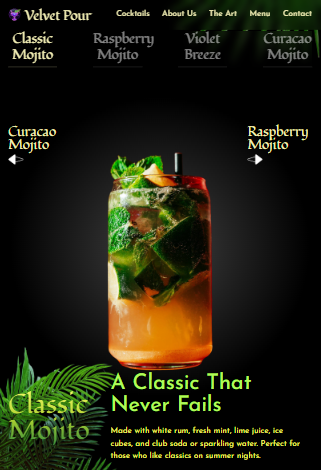
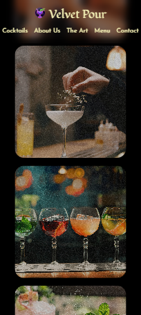

# cocktail_landing_project

🚀 Introduction

This project is a GSAP-powered cocktail landing page built with React and Tailwind CSS, featuring a scroll-driven design packed with engaging animations. It showcases scroll-triggered transitions, pinned sections, image masking effects, and smooth parallax interactions to create a cinematic browsing experience. With GSAP’s ScrollTrigger, text and visuals flow dynamically as you scroll, blending storytelling with modern UI design. The site is fully responsive, ensuring a seamless experience across all devices.

I followed a tutorial by [Adrian Hajdin’s GSAP tutorial](https://github.com/adrianhajdin/gsap_cocktails/tree/main) to learn advanced GSAP techniques and expanded on it with my own design adjustments, text refinements, and styling tweaks to make the project unique.

I made it my own by:

- Refreshing all text content, replacing tutorial copy with unique headings and taglines.

- Revamping colors, fonts, and background gradients to give a fresh visual identity.

- Improving responsive behavior, tweaking layouts and spacing for different screen sizes.

- Cleaning up console output, reorganizing CSS with Tailwind utilities, and resolving errors.

- Updating images and graphics to better match the overall aesthetic and branding.

## ⚙️ Tech Stack

**GSAP** – A powerful JavaScript animation library used to create smooth, scroll-driven experiences. In this project, GSAP powers effects like image masking, fade transitions, pinned sections, and scroll-triggered reveals, adding depth and interactivity to the design.

**React** – A component-based JavaScript library that structures the app into reusable pieces. React makes it easier to organize the layout, manage content, and integrate GSAP animations across sections.

**Tailwind CSS** – A utility-first CSS framework used for fast, responsive styling. Tailwind allows for precise design control with custom gradients, typography, and responsive layouts—all while keeping the code clean and consistent.

**Vite** – A modern build tool and dev server that provides lightning-fast HMR (hot module replacement) during development and optimized builds for production. Perfect for working with animation-heavy projects like this one.

## 🔋 Features

👉 **SplitText Reveals** – Eye-catching text animations that break down words and letters for bold, dynamic intros.

👉 **ScrollTrigger Animations** – Smooth, scroll-driven timelines controlling fades, scaling, masking, and content reveals.

👉 **Parallax Scrolling** – Adds motion depth with layered backgrounds and elements that move at different speeds.

👉 **Pinned Sections** – Keep key sections locked in view while animations play out for immersive storytelling.

👉 **Scroll-Synced Video** – Cinematic video playback that progresses in sync with the user’s scroll.

👉 **Image Masking Effects** – Advanced GSAP masking to transition images seamlessly during scroll.

👉 **Custom Animated Carousel** – A fully custom, GSAP-powered carousel with animated slides and navigation.

👉 **Multi-Section Timelines** – Carefully coordinated animation timelines across different sections for a fluid flow.

👉 **Responsive Experience** – All animations and layouts adapt seamlessly across desktop, tablet, and mobile.

## 📸 Demo

👉 [Live Demo](https://cocktails-gsap-project.netlify.app/)

## 📸 Screenshots

<p align="center">
  
  
  
</p>

## ⚙️ Installation & Setup

Clone the Repository:

```bash
git clone https://github.com/PollyT249/cocktail_landing_project.git
cd cocktail_landing_project
```

Install the project dependencies using npm:

```bash
npm install
```

Running the Project

```bash
npm run dev
```
